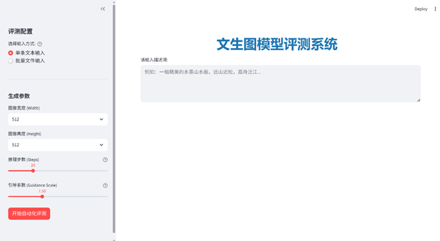
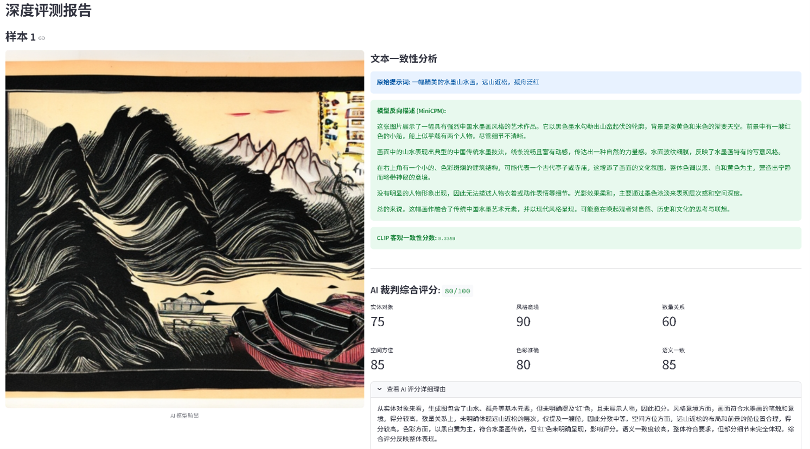

# 🏮 国风文生图评测系统 (Chinese-Style T2I Evaluator)


这是一个专为“中国风”文本生成图像（Text-to-Image）打造的专业、架构清晰的**主客观双重评测系统**。本项目针对 8GB 消费级显卡进行了 Time-Sharing（分时复用）极致优化，在单张显卡上实现了四大 AI 模型的高效协同工作。

---

## ✨ 核心亮点

- **双重评测机制**：结合 CLIP 客观物理距离打分与 Qwen 3 主观语义逻辑打分。
- **国风元素特化**：采用清华系 MiniCPM-V 视觉大模型，精准识别水墨、汉服、飞檐等中国风复杂元素。
- **极致显存优化**：通过模型调度策略（生成时上显卡，生成完切回 CPU），在 8G 显存设备上流畅跑通全链路。
- **可视化报表**：基于 Streamlit 生成六维雷达图与详尽的 AI 评语报告。
- **工程化分层架构**：实现前后端分离、硬编码配置分离与全链路日志监控，高度规范化。

---

## 📂 系统代码结构

代码采用标准分层架构设计，总计包含 6 个核心模块：

| 文件名 | 类型 | 主要功能描述 |
|---|---|---|
| `main_advanced.py` | **前端入口** | 基于 Streamlit 的 UI 界面。负责渲染侧边栏、接收输入、展示图片、绘制六维雷达图及评语。 |
| `evaluate_advanced.py` | **后端核心** | 系统的“大脑”。负责调度所有模型（加载/卸载）、执行生成与评测流水线，管理显存策略。 |
| `config.py` | **配置模块** | 管理全局参数，包括模型路径、Ollama 接口地址、硬件设置（CPU/CUDA）等，实现配置分离。 |
| `logger_setup.py` | **日志模块** | 记录运行日志。将控制台与文件日志分离，记录操作时间与报错跟踪，保障系统健壮性。 |
| `image_utils.py` | **工具模块** | 处理图像底层操作。包含 PIL 与 Base64 互转、图像标准化处理、临时文件管理等。 |
| `data_loader.py` | **数据模块** | 数据预处理。读取 TXT 评测文件、清洗提示词、校验输入合法性。 |

---

## 🧠 核心 AI 模型矩阵

系统采用了本地化部署与 API 调用结合的模式：

1. **Stable Diffusion 2.1** (本地加载 / `diffusers`) —— **“画师”**
   将用户的提示词转化为图像。系统对其进行了显存优化调度。
2. **MiniCPM-V** (Ollama 调用 / VLM) —— **“鉴赏家”**
   视觉理解模型，专用于“看图说话”。对中国风元素极其敏感，能生成高质量中文描述。
3. **CLIP** (本地加载 / `sentence-transformers`) —— **“理科生”**
   计算图像与英文提示词在向量空间中的余弦相似度，代表“像素级的物理匹配度”。
4. **Qwen 3 8B** (Ollama 调用 / LLM) —— **“裁判长”**
   对比“用户原始需求”与“MiniCPM 看到的画面”，从实体、意境、色彩等 6 个维度进行逻辑推理，给出最终评分。

---

## ⚙️ 系统工作流 (Pipeline)

专为 8GB 显存设计的串行分时复用 (Time-Sharing) 流程：
1. **输入与翻译**：接收中文输入并自动翻译为英文适配 SD/CLIP。
2. **生成阶段**：SD 模型加载到 GPU -> 生成图片 -> SD 卸载回 CPU 释放显存。
3. **视觉阶段**：调用 Ollama -> GPU 加载 MiniCPM-V -> 识图生成描述 -> 释放显存。
4. **客观评分**：CPU 运行 CLIP -> 计算图文向量相似度。
5. **主观评分**：调用 Ollama -> GPU 加载 Qwen 3 -> 对比多维度语义 -> 输出 JSON 报告。

---

## 🚀 快速开始 (Quick Start)

本项目推荐使用 [Miniconda](https://docs.conda.io/en/latest/miniconda.html) 进行环境管理，以隔离不同模型之间的依赖冲突。

### 1. 克隆项目到本地
```bash
git clone https://github.com/barbtho/Chinese-Style-T2I-Evaluator.git
cd Chinese-Style-T2I-Evaluator
```

### 2. 配置虚拟环境
为了保证环境纯净，建议创建一个名为 `text2image` 的专属 Python 环境：
```bash
conda create -n text2image python=3.10 -y
conda activate text2image
```

### 3. 安装依赖包
```bash
pip install -r requirements.txt
```

### 4. 准备 Ollama 模型
请确保本地已安装 [Ollama](https://ollama.com/)，并在终端中拉取所需模型：
```bash
ollama run minicpm-v
ollama run qwen:8b
```

### 5. 一键启动
在项目根目录下运行前端服务：
```bash
streamlit run main_advanced.py
```
*(系统启动后，浏览器会自动打开 `http://localhost:8501` 展示评测界面。)*

---

## 📸 运行截图





---

## 📜 许可证 (License)
本项目基于 [MIT License](LICENSE) 开源。欢迎学术交流与二次开发！
